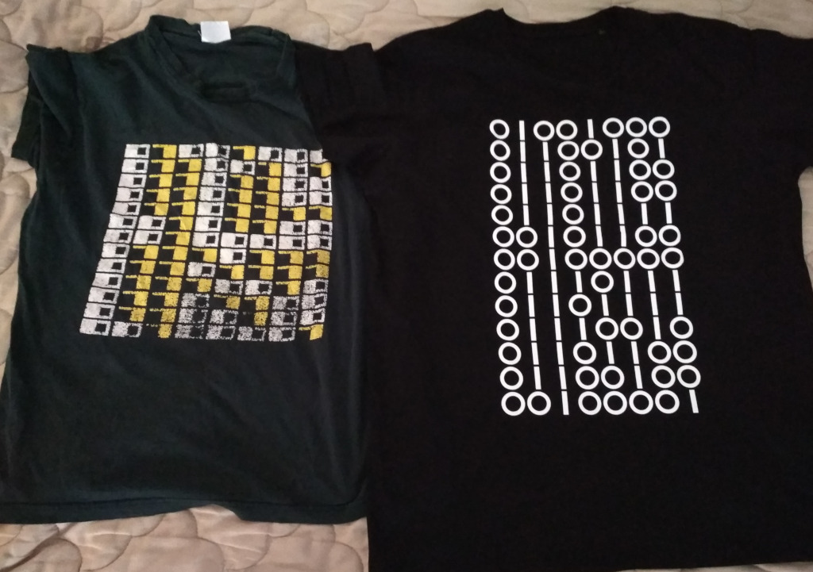

# 'Hello, world!' T-shirt

## How to

Run `make all` to produce all files:

- `output.svg` – SVG of just zeros and ones, designed for printing in white on
  black T-shirts.
- `output-bg.svg` – SVG with black background for preview purposes.
- `generated.html` and `index.html` – HTML files for convenience to preview in a browser.

Requires `python3` to be accessible in `$PATH`.

## Photo

The idea for the design (`output.svg`, on the right) comes from the original
T-shirts of [VKOShP IX (2008) programming contest](https://neerc.ifmo.ru/school/russia-team/archive.html#2008-2009)
(on the left).

